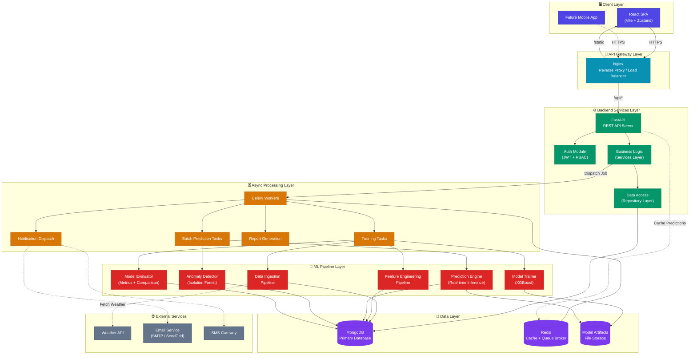
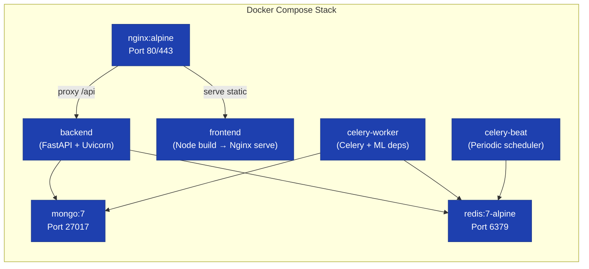

# AI-Based Energy Consumption Prediction System — Software Architecture

---

## 1. Technology Stack

| Layer | Technology | Justification |
|-------|-----------|---------------|
| **Frontend** | React 18 + Vite | Component-based SPA with fast HMR; rich ecosystem for charts (Recharts/Chart.js) and state management (Zustand) |
| **Backend API** | FastAPI (Python 3.11+) | Async-first, auto-generated OpenAPI docs, native Pydantic validation, excellent ML ecosystem interop |
| **Database** | MongoDB 7+ | Schema-flexible document store ideal for time-series energy data with varying metadata; native aggregation pipeline for analytics |
| **ML Engine** | Python + XGBoost + scikit-learn | XGBoost for tabular energy data (fast training, high accuracy); scikit-learn for preprocessing, evaluation, and anomaly detection |
| **Authentication** | JWT (PyJWT + python-jose) | Stateless, scalable token-based auth with role claims embedded in the token payload |
| **Containerization** | Docker + Docker Compose | Consistent dev/prod environments; service isolation; easy horizontal scaling |
| **Reverse Proxy** | Nginx | Static file serving for React, API proxying, SSL termination, load balancing |
| **Task Queue** | Celery + Redis | Async execution of model training, batch predictions, report generation, and notification dispatch |
| **Caching** | Redis | Prediction caching, rate limiting, session blacklisting |

---

## 2. Folder Structure

```
energy-prediction-system/
│
├── docker/                          # Container orchestration
│   ├── docker-compose.yml           # Multi-service composition
│   ├── docker-compose.dev.yml       # Dev overrides (hot reload, debug)
│   ├── docker-compose.prod.yml      # Prod overrides (replicas, resources)
│   ├── nginx/
│   │   └── nginx.conf               # Reverse proxy configuration
│   └── mongo/
│       └── init-db.js               # DB initialization & seed script
│
├── frontend/                        # React SPA
│   ├── public/
│   │   └── index.html
│   ├── src/
│   │   ├── main.jsx                 # App entry point
│   │   ├── App.jsx                  # Root component + router
│   │   ├── assets/                  # Static images, icons, fonts
│   │   ├── components/              # Reusable UI components
│   │   │   ├── common/              # Button, Modal, Loader, Alert
│   │   │   ├── charts/              # TimeSeriesChart, Heatmap, FeatureImportance
│   │   │   ├── layout/              # Navbar, Sidebar, Footer
│   │   │   └── forms/               # LoginForm, AlertConfigForm, FilterPanel
│   │   ├── pages/                   # Route-level page components
│   │   │   ├── Dashboard.jsx
│   │   │   ├── Forecasts.jsx
│   │   │   ├── Anomalies.jsx
│   │   │   ├── Reports.jsx
│   │   │   ├── ModelWorkbench.jsx
│   │   │   ├── UserManagement.jsx
│   │   │   ├── Settings.jsx
│   │   │   ├── Login.jsx
│   │   │   └── Register.jsx
│   │   ├── hooks/                   # Custom React hooks
│   │   │   ├── useAuth.js
│   │   │   ├── useEnergyData.js
│   │   │   └── usePredictions.js
│   │   ├── services/                # API client modules
│   │   │   ├── api.js               # Axios instance + interceptors
│   │   │   ├── authService.js
│   │   │   ├── energyService.js
│   │   │   ├── predictionService.js
│   │   │   └── alertService.js
│   │   ├── store/                   # Zustand state stores
│   │   │   ├── authStore.js
│   │   │   └── dashboardStore.js
│   │   ├── utils/                   # Helpers, formatters, constants
│   │   │   ├── constants.js
│   │   │   ├── dateUtils.js
│   │   │   └── validators.js
│   │   └── styles/                  # Global CSS
│   │       ├── index.css
│   │       └── variables.css
│   ├── Dockerfile
│   ├── package.json
│   └── vite.config.js
│
├── backend/                         # FastAPI application
│   ├── app/
│   │   ├── main.py                  # FastAPI app factory + lifespan
│   │   ├── config.py                # Settings via Pydantic BaseSettings
│   │   ├── database.py              # MongoDB connection (Motor async driver)
│   │   ├── dependencies.py          # Dependency injection (get_db, get_current_user)
│   │   │
│   │   ├── models/                  # Pydantic schemas (request/response)
│   │   │   ├── user.py
│   │   │   ├── meter.py
│   │   │   ├── energy.py
│   │   │   ├── prediction.py
│   │   │   ├── anomaly.py
│   │   │   ├── alert.py
│   │   │   └── model_registry.py
│   │   │
│   │   ├── routers/                 # API route handlers
│   │   │   ├── auth.py
│   │   │   ├── users.py
│   │   │   ├── meters.py
│   │   │   ├── energy.py
│   │   │   ├── predictions.py
│   │   │   ├── anomalies.py
│   │   │   ├── alerts.py
│   │   │   ├── models.py
│   │   │   └── system.py
│   │   │
│   │   ├── services/                # Business logic layer
│   │   │   ├── auth_service.py
│   │   │   ├── user_service.py
│   │   │   ├── energy_service.py
│   │   │   ├── prediction_service.py
│   │   │   ├── anomaly_service.py
│   │   │   ├── alert_service.py
│   │   │   ├── report_service.py
│   │   │   └── notification_service.py
│   │   │
│   │   ├── repositories/            # Data access layer (MongoDB queries)
│   │   │   ├── user_repository.py
│   │   │   ├── meter_repository.py
│   │   │   ├── energy_repository.py
│   │   │   ├── prediction_repository.py
│   │   │   └── anomaly_repository.py
│   │   │
│   │   ├── middleware/               # Cross-cutting concerns
│   │   │   ├── auth_middleware.py    # JWT verification
│   │   │   ├── rate_limiter.py
│   │   │   ├── cors.py
│   │   │   └── logging_middleware.py
│   │   │
│   │   └── utils/                   # Shared utilities
│   │       ├── security.py          # Password hashing, JWT encode/decode
│   │       ├── validators.py
│   │       └── exceptions.py        # Custom exception classes
│   │
│   ├── tasks/                       # Celery async tasks
│   │   ├── celery_app.py            # Celery configuration
│   │   ├── prediction_tasks.py      # Batch prediction jobs
│   │   ├── training_tasks.py        # Model retraining jobs
│   │   ├── report_tasks.py          # Report generation
│   │   └── notification_tasks.py    # Email/SMS dispatch
│   │
│   ├── tests/                       # Test suite
│   │   ├── conftest.py
│   │   ├── test_auth.py
│   │   ├── test_energy.py
│   │   └── test_predictions.py
│   │
│   ├── Dockerfile
│   └── requirements.txt
│
├── ml_service/                      # ML pipeline (standalone service)
│   ├── pipelines/
│   │   ├── data_ingestion.py        # Raw data loading & validation
│   │   ├── feature_engineering.py   # Feature extraction & transformation
│   │   ├── training.py              # Model training & hyperparameter tuning
│   │   ├── evaluation.py            # Metrics computation & comparison
│   │   └── prediction.py            # Inference pipeline
│   │
│   ├── models/                      # Model definitions & wrappers
│   │   ├── xgboost_model.py
│   │   ├── base_model.py            # Abstract base for model interface
│   │   └── anomaly_detector.py      # Isolation Forest / Z-score
│   │
│   ├── utils/
│   │   ├── preprocessing.py         # Scalers, encoders, imputers
│   │   ├── feature_store.py         # Feature definitions & registry
│   │   └── metrics.py               # MAE, RMSE, MAPE, R² calculations
│   │
│   ├── artifacts/                   # Trained model artifacts (gitignored)
│   │   └── .gitkeep
│   │
│   ├── notebooks/                   # Exploratory analysis (Jupyter)
│   │   └── 01_eda.ipynb
│   │
│   ├── Dockerfile
│   └── requirements.txt
│
├── data/                            # Sample/seed data (gitignored in prod)
│   ├── raw/
│   ├── processed/
│   └── sample/
│
├── docs/                            # Documentation
│   ├── system_design.md
│   ├── api_reference.md
│   └── deployment_guide.md
│
├── .env.example                     # Environment variable template
├── .gitignore
├── README.md
└── Makefile                         # Common commands (build, run, test)
```

---

## 3. Database Collections (MongoDB)

### 3.1 `users`

| Field | Type | Description |
|-------|------|-------------|
| `_id` | ObjectId | Primary key |
| `email` | String (unique, indexed) | User email address |
| `password_hash` | String | Bcrypt hashed password |
| `full_name` | String | Display name |
| `role` | String (enum) | `consumer` \| `facility_manager` \| `utility_analyst` \| `admin` \| `data_scientist` |
| `is_active` | Boolean | Account status |
| `assigned_meters` | Array\<ObjectId\> | Meters this user can access |
| `notification_prefs` | Object | `{ email: bool, sms: bool, in_app: bool }` |
| `created_at` | DateTime | Account creation timestamp |
| `updated_at` | DateTime | Last modification timestamp |

**Indexes:** `{ email: 1 }` (unique), `{ role: 1 }`

---

### 3.2 `meters`

| Field | Type | Description |
|-------|------|-------------|
| `_id` | ObjectId | Primary key |
| `meter_id` | String (unique, indexed) | External smart meter identifier |
| `location` | Object | `{ building, floor, zone, lat, lng }` |
| `type` | String | `residential` \| `commercial` \| `industrial` |
| `owner_id` | ObjectId | Reference to `users._id` |
| `metadata` | Object | Flexible metadata (capacity, install date, etc.) |
| `is_active` | Boolean | Meter status |
| `created_at` | DateTime | Registration timestamp |

**Indexes:** `{ meter_id: 1 }` (unique), `{ owner_id: 1 }`, `{ "location.building": 1, "location.zone": 1 }`

---

### 3.3 `energy_readings`

| Field | Type | Description |
|-------|------|-------------|
| `_id` | ObjectId | Primary key |
| `meter_id` | ObjectId (indexed) | Reference to `meters._id` |
| `timestamp` | DateTime (indexed) | Reading timestamp |
| `consumption_kwh` | Float | Energy consumed in kWh |
| `voltage` | Float | Voltage reading (optional) |
| `current` | Float | Current reading (optional) |
| `power_factor` | Float | Power factor (optional) |
| `source` | String | `smart_meter` \| `csv_import` \| `api_feed` |
| `is_valid` | Boolean | Data quality flag |

**Indexes:** `{ meter_id: 1, timestamp: -1 }` (compound), `{ timestamp: -1 }` (TTL-eligible for archival)

> [!IMPORTANT]
> This is the **highest-volume collection**. Use MongoDB time-series collection type or apply date-based sharding for production scale. Partition by `meter_id` + monthly buckets.

---

### 3.4 `weather_data`

| Field | Type | Description |
|-------|------|-------------|
| `_id` | ObjectId | Primary key |
| `location_key` | String (indexed) | Geographic key (city/region code) |
| `timestamp` | DateTime (indexed) | Observation timestamp |
| `temperature_c` | Float | Temperature in Celsius |
| `humidity_pct` | Float | Relative humidity (%) |
| `wind_speed_kmh` | Float | Wind speed in km/h |
| `cloud_cover_pct` | Float | Cloud cover (%) |
| `is_holiday` | Boolean | Whether the day is a public holiday |
| `day_of_week` | Integer | 0 (Mon) – 6 (Sun) |

**Indexes:** `{ location_key: 1, timestamp: -1 }` (compound)

---

### 3.5 `predictions`

| Field | Type | Description |
|-------|------|-------------|
| `_id` | ObjectId | Primary key |
| `meter_id` | ObjectId (indexed) | Reference to `meters._id` |
| `model_id` | ObjectId | Reference to `models._id` |
| `horizon` | String | `hourly` \| `daily` \| `weekly` |
| `predicted_at` | DateTime | When the prediction was generated |
| `target_start` | DateTime (indexed) | Prediction window start |
| `target_end` | DateTime | Prediction window end |
| `predicted_kwh` | Float | Point forecast value |
| `confidence_80` | Object | `{ lower: Float, upper: Float }` |
| `confidence_95` | Object | `{ lower: Float, upper: Float }` |
| `actual_kwh` | Float \| null | Filled in later for accuracy tracking |
| `feature_importance` | Array\<Object\> | `[{ feature: String, weight: Float }]` |

**Indexes:** `{ meter_id: 1, target_start: -1 }` (compound), `{ model_id: 1 }`

---

### 3.6 `anomalies`

| Field | Type | Description |
|-------|------|-------------|
| `_id` | ObjectId | Primary key |
| `meter_id` | ObjectId (indexed) | Reference to `meters._id` |
| `timestamp` | DateTime (indexed) | When the anomaly occurred |
| `detected_at` | DateTime | When the system detected it |
| `type` | String | `spike` \| `drop` \| `pattern_break` \| `flatline` |
| `severity` | String | `low` \| `medium` \| `high` |
| `actual_kwh` | Float | Observed consumption |
| `expected_kwh` | Float | Model's expected consumption |
| `deviation_pct` | Float | % deviation from expected |
| `annotation` | Object \| null | `{ note: String, tagged_by: ObjectId, tagged_at: DateTime }` |
| `is_resolved` | Boolean | Whether the anomaly has been reviewed |

**Indexes:** `{ meter_id: 1, timestamp: -1 }`, `{ severity: 1, is_resolved: 1 }`

---

### 3.7 `models`

| Field | Type | Description |
|-------|------|-------------|
| `_id` | ObjectId | Primary key |
| `name` | String | Model name (e.g., `xgboost_hourly_v3`) |
| `version` | String | Semantic version |
| `algorithm` | String | `xgboost` \| `random_forest` \| `lstm` \| `prophet` |
| `horizon` | String | `hourly` \| `daily` \| `weekly` |
| `status` | String | `training` \| `evaluating` \| `active` \| `archived` |
| `metrics` | Object | `{ mae, rmse, mape, r2 }` |
| `hyperparameters` | Object | Full hyperparameter set used |
| `training_data_range` | Object | `{ start: DateTime, end: DateTime }` |
| `artifact_path` | String | Path to serialized model file |
| `trained_at` | DateTime | Training completion timestamp |
| `deployed_at` | DateTime \| null | When promoted to production |

**Indexes:** `{ status: 1, horizon: 1 }`, `{ algorithm: 1 }`

---

### 3.8 `alert_configs`

| Field | Type | Description |
|-------|------|-------------|
| `_id` | ObjectId | Primary key |
| `user_id` | ObjectId (indexed) | Reference to `users._id` |
| `meter_id` | ObjectId | Scope of the alert |
| `condition` | Object | `{ metric: String, operator: "gt"\|"lt", threshold: Float, window_hours: Int }` |
| `channels` | Array\<String\> | `["email", "sms", "in_app"]` |
| `is_enabled` | Boolean | Active toggle |
| `created_at` | DateTime | Configuration timestamp |

**Indexes:** `{ user_id: 1, is_enabled: 1 }`

---

### 3.9 `audit_logs`

| Field | Type | Description |
|-------|------|-------------|
| `_id` | ObjectId | Primary key |
| `user_id` | ObjectId | Who performed the action |
| `action` | String | `login` \| `predict` \| `export` \| `retrain` \| `config_change` \| ... |
| `resource_type` | String | `meter` \| `model` \| `user` \| `alert` |
| `resource_id` | ObjectId | ID of the affected resource |
| `details` | Object | Flexible payload describing the action |
| `ip_address` | String | Client IP |
| `timestamp` | DateTime (indexed) | When the action occurred |

**Indexes:** `{ timestamp: -1 }` (TTL: 90 days), `{ user_id: 1, action: 1 }`

---

## 4. API List

### 4.1 Authentication

| Method | Endpoint | Description | Auth |
|--------|----------|-------------|------|
| POST | `/api/v1/auth/register` | Register a new user | Public |
| POST | `/api/v1/auth/login` | Authenticate and receive JWT | Public |
| POST | `/api/v1/auth/refresh` | Refresh access token | Token |
| POST | `/api/v1/auth/logout` | Blacklist current token | Token |
| POST | `/api/v1/auth/forgot-password` | Initiate password reset | Public |
| POST | `/api/v1/auth/reset-password` | Complete password reset | Public (reset token) |

### 4.2 User Management

| Method | Endpoint | Description | Auth |
|--------|----------|-------------|------|
| GET | `/api/v1/users/me` | Get current user profile | Token |
| PUT | `/api/v1/users/me` | Update current user profile | Token |
| GET | `/api/v1/users` | List all users (paginated) | Admin |
| GET | `/api/v1/users/{id}` | Get user by ID | Admin |
| PUT | `/api/v1/users/{id}/role` | Update user role | Admin |
| DELETE | `/api/v1/users/{id}` | Deactivate user account | Admin |

### 4.3 Meters

| Method | Endpoint | Description | Auth |
|--------|----------|-------------|------|
| POST | `/api/v1/meters` | Register a new meter | Admin / Manager |
| GET | `/api/v1/meters` | List meters (filtered by user scope) | Token |
| GET | `/api/v1/meters/{id}` | Get meter details | Token |
| PUT | `/api/v1/meters/{id}` | Update meter metadata | Admin / Manager |
| DELETE | `/api/v1/meters/{id}` | Deactivate a meter | Admin |

### 4.4 Energy Data

| Method | Endpoint | Description | Auth |
|--------|----------|-------------|------|
| POST | `/api/v1/energy/upload` | Upload CSV energy data | Manager / Analyst |
| GET | `/api/v1/energy/{meter_id}` | Get readings for a meter (time range, granularity) | Token |
| GET | `/api/v1/energy/{meter_id}/summary` | Aggregated stats (avg, peak, total by period) | Token |
| GET | `/api/v1/energy/compare` | Compare consumption across multiple meters | Manager / Analyst |

### 4.5 Predictions

| Method | Endpoint | Description | Auth |
|--------|----------|-------------|------|
| GET | `/api/v1/predictions/{meter_id}` | Get predictions for a meter (horizon, date range) | Token |
| POST | `/api/v1/predictions/generate` | Trigger on-demand prediction for a meter | Token |
| POST | `/api/v1/predictions/batch` | Trigger batch prediction for multiple meters | Manager / Admin |
| GET | `/api/v1/predictions/{meter_id}/accuracy` | Get prediction vs. actual comparison | Token |

### 4.6 Anomalies

| Method | Endpoint | Description | Auth |
|--------|----------|-------------|------|
| GET | `/api/v1/anomalies/{meter_id}` | List anomalies for a meter (filters: severity, date) | Token |
| GET | `/api/v1/anomalies/{id}` | Get anomaly detail | Token |
| PUT | `/api/v1/anomalies/{id}/annotate` | Add annotation to anomaly | Manager |
| PUT | `/api/v1/anomalies/{id}/resolve` | Mark anomaly as resolved | Manager |

### 4.7 Alerts

| Method | Endpoint | Description | Auth |
|--------|----------|-------------|------|
| POST | `/api/v1/alerts/config` | Create alert configuration | Token |
| GET | `/api/v1/alerts/config` | List user's alert configurations | Token |
| PUT | `/api/v1/alerts/config/{id}` | Update alert configuration | Token |
| DELETE | `/api/v1/alerts/config/{id}` | Delete alert configuration | Token |
| GET | `/api/v1/alerts/history` | Get triggered alert history | Token |

### 4.8 Models (ML Management)

| Method | Endpoint | Description | Auth |
|--------|----------|-------------|------|
| GET | `/api/v1/models` | List all registered models | Data Scientist / Admin |
| GET | `/api/v1/models/{id}` | Get model details & metrics | Data Scientist / Admin |
| POST | `/api/v1/models/train` | Trigger model training job | Data Scientist |
| POST | `/api/v1/models/{id}/deploy` | Promote model to active | Data Scientist / Admin |
| GET | `/api/v1/models/compare` | Compare metrics across models | Data Scientist |

### 4.9 System & Reports

| Method | Endpoint | Description | Auth |
|--------|----------|-------------|------|
| GET | `/api/v1/system/health` | Health check (DB, Redis, ML service) | Public |
| GET | `/api/v1/system/metrics` | System performance metrics | Admin |
| GET | `/api/v1/audit-logs` | Query audit trail | Admin |
| POST | `/api/v1/reports/generate` | Generate PDF/CSV report (async) | Manager / Analyst |
| GET | `/api/v1/reports/{id}/download` | Download generated report | Token |

---

## 5. Module Diagram



### Module Communication Summary

| From | To | Protocol | Purpose |
|------|----|----------|---------|
| React SPA | Nginx | HTTPS | All client requests |
| Nginx | FastAPI | HTTP (internal) | API proxying |
| FastAPI | MongoDB | TCP (Motor async) | CRUD operations |
| FastAPI | Redis | TCP | Caching, rate limiting |
| FastAPI | Celery (via Redis) | AMQP | Job dispatch |
| Celery Worker | ML Pipeline | In-process (Python) | Training & inference |
| ML Pipeline | MongoDB | TCP (PyMongo) | Read features, write predictions |
| ML Pipeline | File Storage | Filesystem / S3 | Save/load model artifacts |
| Celery Worker | Email/SMS | HTTPS | Notification delivery |
| ML Pipeline | Weather API | HTTPS | External feature data |

---

## 6. Deployment Flow

### 6.1 Container Architecture



### 6.2 Docker Compose Services

| Service | Image / Build | Ports | Depends On | Replicas (Prod) |
|---------|--------------|-------|------------|-----------------|
| `nginx` | nginx:alpine | 80, 443 | frontend, backend | 1 |
| `frontend` | Build from `./frontend` | — (served by nginx) | — | 1 |
| `backend` | Build from `./backend` | 8000 (internal) | mongo, redis | 2–4 |
| `celery-worker` | Build from `./backend` | — | mongo, redis | 2–4 |
| `celery-beat` | Build from `./backend` | — | redis | 1 |
| `mongo` | mongo:7 | 27017 (internal) | — | 1 (replica set for prod) |
| `redis` | redis:7-alpine | 6379 (internal) | — | 1 |

### 6.3 CI/CD Pipeline

```
┌──────────┐    ┌──────────┐    ┌──────────┐    ┌──────────┐    ┌──────────┐
│   Push   │───▶│  Lint &  │───▶│  Build   │───▶│  Push    │───▶│  Deploy  │
│  to Git  │    │  Test    │    │  Docker  │    │  Images  │    │  to Env  │
│          │    │          │    │  Images  │    │  to Reg  │    │          │
└──────────┘    └──────────┘    └──────────┘    └──────────┘    └──────────┘
     │               │               │               │               │
     │          ┌─────────┐    ┌─────────┐    ┌─────────┐    ┌─────────────┐
     │          │• Linting │    │• frontend│    │• Docker  │    │• dev: auto  │
     │          │• pytest  │    │• backend │    │  Hub or  │    │• staging:   │
     │          │• mypy    │    │• ml_svc  │    │  GCR/ECR │    │  manual gate│
     │          └─────────┘    └─────────┘    └─────────┘    │• prod:      │
     │                                                        │  manual gate│
     │                                                        └─────────────┘
```

### 6.4 Environment Strategy

| Environment | Trigger | Database | Purpose |
|-------------|---------|----------|---------|
| **Development** | Every commit to `dev` branch | Local MongoDB (Docker) | Feature development, unit tests |
| **Staging** | PR merge to `main` | Staging MongoDB | Integration testing, UAT |
| **Production** | Manual approval after staging | Production MongoDB (replica set) | Live system |

### 6.5 Scaling Strategy

| Component | Scaling Approach | When to Scale |
|-----------|-----------------|---------------|
| **Backend API** | Horizontal (increase `backend` replicas) | API response time > 2s at p95 |
| **Celery Workers** | Horizontal (increase `celery-worker` replicas) | Job queue depth > 100 |
| **MongoDB** | Vertical first → Sharding by `meter_id` | Storage > 80% or query latency > 500ms |
| **Redis** | Vertical (larger instance) | Memory usage > 75% |
| **Nginx** | Stays at 1 (handles high throughput natively) | Rarely needs scaling |

> [!TIP]
> For a final-year project demo, a single replica of each service on Docker Compose is sufficient. The architecture above is designed so that scaling to production only requires changing replica counts and adding a MongoDB replica set — no code changes needed.

---

> **Document Version:** 1.0
> **Date:** 20 July 2026
> **Status:** Draft — Pending Review
