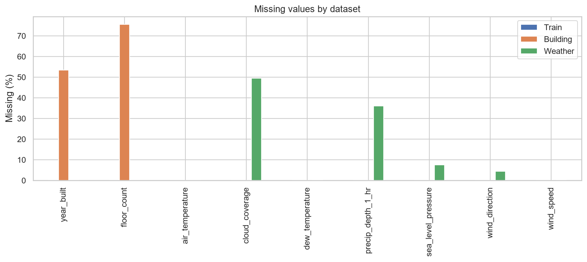
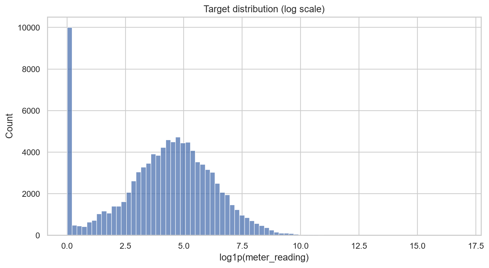
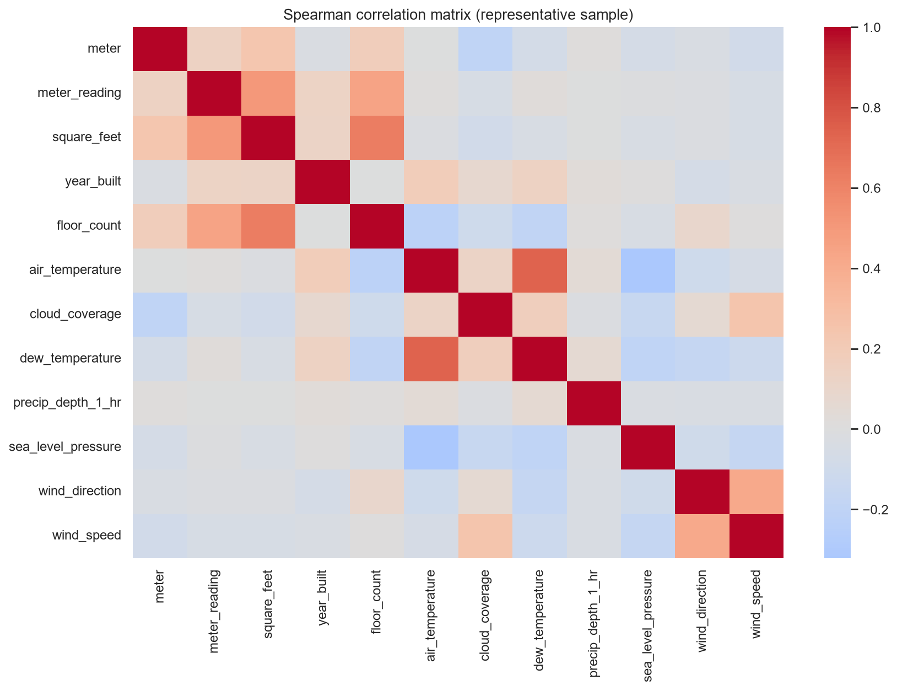
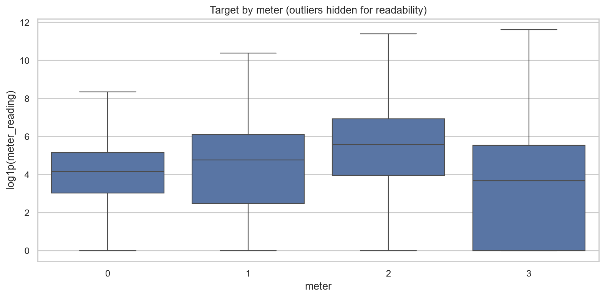
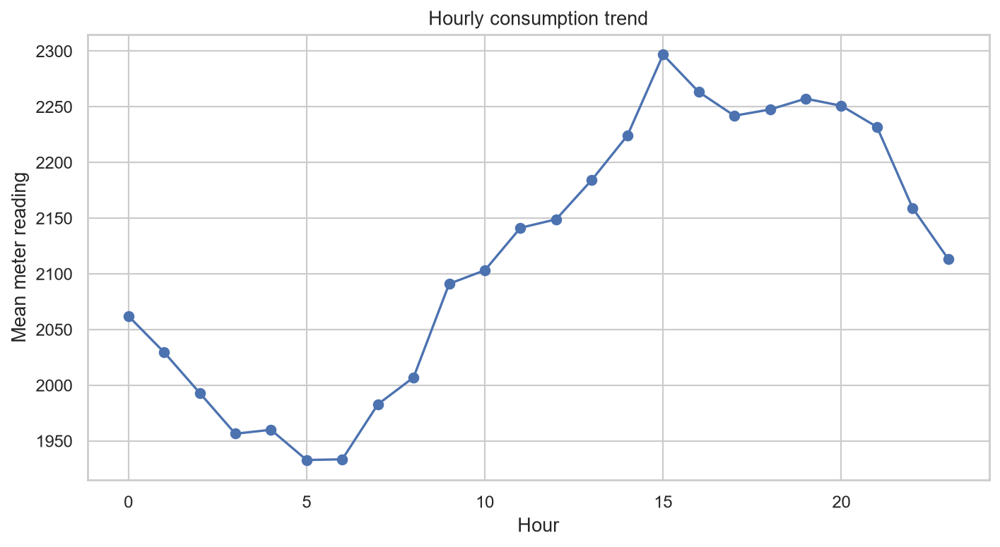
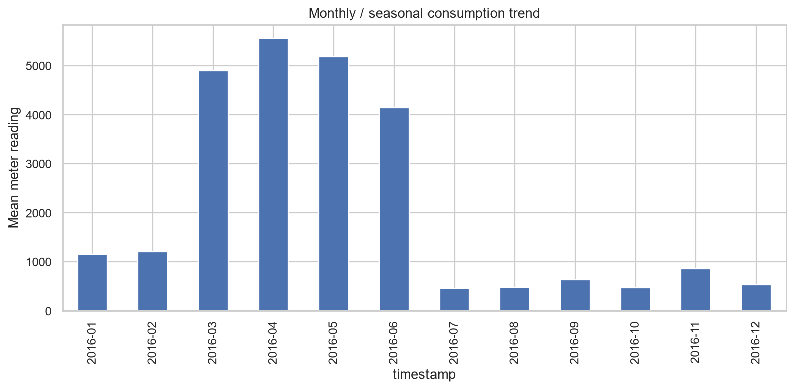
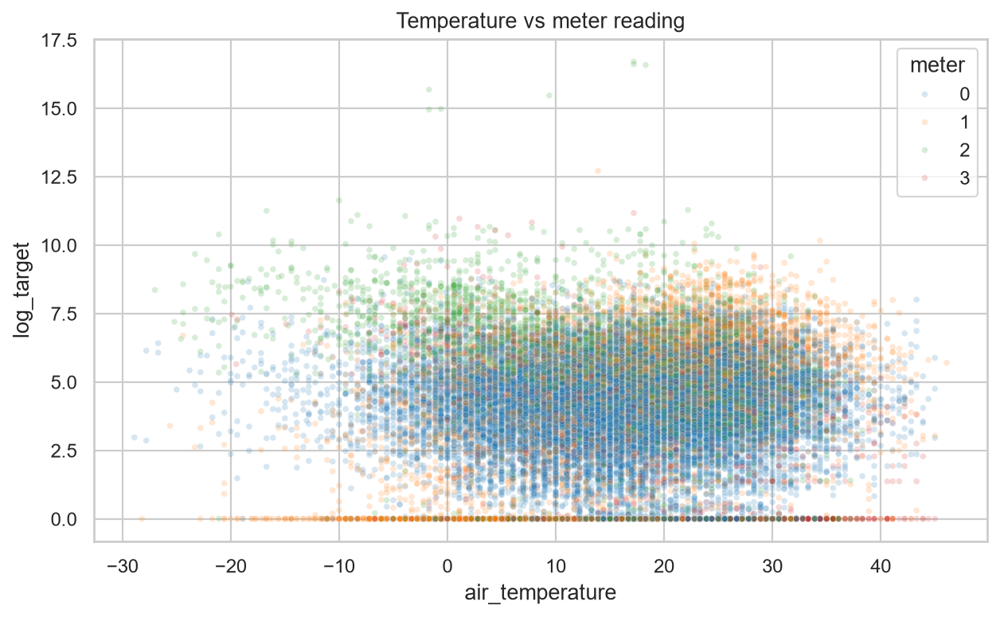

# Week 1 Exploratory Data Analysis Report

## Executive Summary

EDA confirms strong target skew and outliers, substantial zero readings, building/meter/site heterogeneity, annual seasonality, and weather/metadata missingness. Plots use exact full-data time/meter aggregates; dense bivariate charts and correlations use a deterministic 101,080-row sample.

## Data Quality Assessment

### Missing values

| Dataset | Column | Missing | Percent |
| --- | --- | --- | --- |
| building | year_built | 774 | 53.42% |
| building | floor_count | 1,094 | 75.50% |
| weather | air_temperature | 55 | 0.04% |
| weather | cloud_coverage | 69,173 | 49.49% |
| weather | dew_temperature | 113 | 0.08% |
| weather | precip_depth_1_hr | 50,289 | 35.98% |
| weather | sea_level_pressure | 10,618 | 7.60% |
| weather | wind_direction | 6,268 | 4.48% |
| weather | wind_speed | 304 | 0.22% |

### Duplicates, timestamps, constants and memory

- Duplicate train composite keys: **0**; building duplicate rows: **0**; weather duplicate rows: **0**.
- Invalid timestamps: train **0**, weather **0**.
- Constant columns: **none** in all three source tables.
- Raw CSV footprint: approximately **654.33 MB**. In-memory merged data will be materially larger; use explicit dtypes, chunking or column pruning.

### Target, zeros, outliers and skewness

- Target zeros: **1,873,976 (9.27%)**.
- Mean / standard deviation: **2117.121 / 153235.621**; sampled median / p99 / max: **79.280 / 5529.560 / 21,904,700.000**.
- Sample target skewness: **94.60**, demonstrating an extremely long right tail. Investigate extremes by meter/building/time; do not automatically delete them because major loads can be valid.
- Highly skewed sampled numeric fields (|skew| > 2): `meter_reading` (94.60), `precip_depth_1_hr` (18.89), `square_feet` (2.68), `floor_count` (2.47).

### Domain findings

- Meter codes have very different observation counts and consumption scales; retain meter identity and evaluate per meter.
- Site/building/primary-use plots show substantial structural differences; static metadata is informative but identifiers require careful encoding.
- Weather availability is high but not perfect (exact merge match **99.55%**, **90,495** training rows unmatched). Temperature relationships are nonlinear and confounded by site, season, building and meter.
- Hourly, daily and monthly aggregates confirm time dependence and seasonality. Random splitting would overstate generalization.
- Potential noisy fields: sparse `floor_count`/`year_built`, frequently missing weather measures, and raw high-cardinality IDs. These are candidates for validation—not automatic removal.

## Correlation Analysis

The heatmap reports Spearman correlations on a deterministic sample because Pearson correlation is fragile under the target’s extreme skew. Correlation is descriptive, not evidence of causation or standalone feature importance. Identifier codes should not be interpreted as ordinal even if included in numeric summaries.

## Important Visualizations

Additional plots in `reports/figures/` cover daily trends, sites, buildings, primary use, square footage, meter distribution, weather distributions and building size.

## Potential Preprocessing Requirements (Recommendation Only)

Parse timestamps; preserve train/validation boundaries; impute nullable metadata and weather using training-only/site-aware logic; add explicit missingness indicators where useful; encode categorical fields; consider `log1p` target modelling with non-negative inverse predictions; use robust scaling only for scale-sensitive models; and validate outlier policies by meter. Do not fit preprocessing on future periods.
